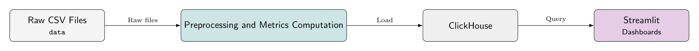
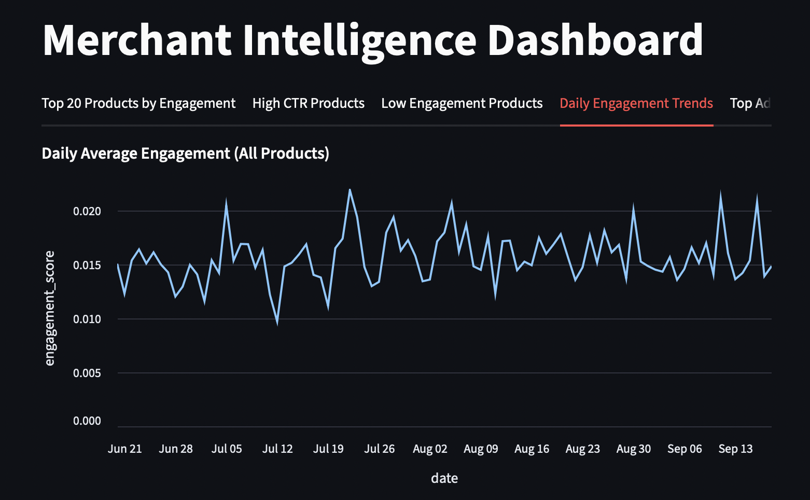

# ClickHouse Retail Analytics Dashboard

An end-to-end merchant intelligence analytics project built on top of ClickHouse, using the [RetailRocket recommender system dataset](https://www.kaggle.com/datasets/retailrocket/ecommerce-dataset/data).  
The project ingests raw user interaction events, computes daily and product-level engagement metrics, stores them in ClickHouse, and exposes insights through an interactive Streamlit dashboard.

This project demonstrates:
- Analytical data modeling
- ClickHouse-optimized metric computation
- Scalable event-level analytics

---

## Business Use Case

E-commerce teams need fast, reliable answers to questions like:

- Which products drive the most engagement?
- Which products have high CTR but low volume (hidden opportunities)?
- Which products are declining in engagement?
- How does event activity trend daily?
- What should be promoted, fixed, or retired?

This project answers those questions using analytics at scale.

---

## Architecture Overview




---

## Project Structure

```bash
.
├── src/
│ ├── data.py                               # Data loading, preprocessing, and metrics
│ ├── clickhouse.py                         # ClickHouse schema and upload logic
│ └── main.py                               # End-to-end ETL pipeline
│
├── dashboard/
│ ├── app.py                                # Streamlit dashboard
│ └── config.py                             # Dashboard configuration
│
├── data/
│ ├── events.csv
│ ├── clean_events.csv
│ ├── item_properties_part1.csv
│ └── product_metrics_daily.csv
└── README.md
```


---

## Dataset

RetailRocket Recommender System Dataset containing **event-level data**. It includes:
- User interactions (view, add-to-cart, transaction)
- Timestamps
- Product identifiers
- Item metadata


---

## Data Processing & Metrics

Event Preprocessing:
- Timestamp normalization
- Event type encoding
- Filtering invalid or incomplete records
- Joining product metadata

Computed Metrics (Daily & Product-Level):
- Impressions
- Clicks
- Add-to-cart events
- Transactions
- CTR (Click-Through Rate)
- Engagement score
- Daily trends per product

Metrics are materialized and stored in ClickHouse for fast aggregation.

---

## Dashboard Features (Streamlit)



The interactive dashboard provides:

- Top Engagement Products
- High CTR Products
- Low Engagement Products
- Daily Engagement Trends
- Top Performing Products Over Time

All views are backed directly by ClickHouse queries, ensuring sub-second response times even on large datasets.

---

## How to Run

### 1️. Install Dependencies
```bash
pip install -r requirements.txt
```

### 2. Setup Database
Execute SQL queries in `sql/db_tables.sql`

This will:
- Create database
- Create table

### 3. Run Pipeline
```bash
python -m src.main --path data/events.csv --table merchant_intelligence.events
```

This will:
- Load raw CSVs
- Preprocess events
- Compute metrics
- Upload tables to ClickHouse

### 4. Launch Dashboard
```bash
streamlit run dashboard/app.py
```